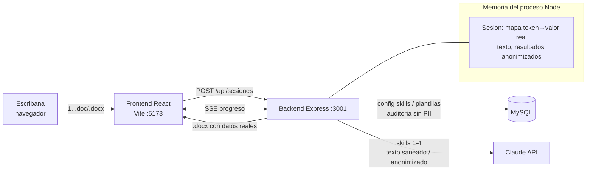

# Arquitectura

## Vista general

## Flujo de una ejecución

1. **Subida.** `multer` recibe el archivo en memoria (`memoryStorage`); nunca se escribe en disco. El archivo es opcional si la escribana o el escribano escribe los antecedentes en el formulario (`antecedentes`); si hay ambos, se concatenan antes del paso siguiente.
2. **Parseo.** `mammoth` (`.docx`) o `word-extractor` (`.doc`) convierten el binario en texto plano. El buffer se libera.
3. **Fase A de anonimización (regex).** DNI, CUIT/CUIL, correos y teléfonos se reemplazan por `[[DNI_1]]`, `[[CUIT_1]]`, etc. El mapa token→valor se guarda en la sesión.
4. **Sesión.** Se crea un UUID; en MySQL solo se registra el UUID, el tamaño del archivo y los estados.
5. **Skill 1 – extractor.** Recibe el texto pre-saneado y devuelve JSON estructurado con `entidades[]` (`id_sugerido`, `valor_literal`, `variantes[]`). El servidor:
   - agrega cada entidad al mapa (`[[VENDEDOR_1]]` → "Juan Pérez"),
   - reemplaza todas las formas en el texto (más largas primero),
   - produce una copia de la extracción sin `valor_literal`/`variantes` y con los valores reales sustituidos,
   - descarta el texto original.
6. **Skills 2, 3 y 4.** Solo reciben texto y JSON anonimizados. Antes de cada llamada, `contieneDatosReales()` verifica que la entrada no contenga ningún valor del mapa; si lo detecta, aborta (`FUGA_DATOS`).
7. **Progreso.** Cada cambio de estado se emite por `EventEmitter` → SSE. El historial se guarda en la sesión para reconexiones.
8. **Exportación.** `docxBuilder` rehidrata los tokens con el mapa y arma el `.docx` (minuta + Anexo I estudio de títulos + Anexo II fiscal/registral + Anexo III datos extraídos). Se envía y la sesión se destruye.

## Iteraciones (mejorar un resultado ya generado)

`POST /api/sesiones/:id/iterar` vuelve a llamar a `ejecutarPipeline(sesion, { iteracionFeedback })`. A diferencia de un reintento (que conserva todo lo que ya completó y sigue desde el skill que falló), una iteración conserva **solo la extracción** y vuelve a correr el resto de los skills del modo, cada uno recibiendo su propio resultado anterior (`sesion.resultados[clave]`) más el pedido de la escribana o el escribano, con la instrucción de generar una versión mejorada en vez de partir de cero.

El pedido de mejora es texto libre de la escribana o el escribano y puede mencionar un dato nuevo que no estaba en el documento original. Como el extractor no vuelve a correr sobre el documento completo, el pedido pasa por su propio mini-análisis: saneo por regex + reemplazo de entidades ya conocidas (`presanear` + `reemplazarTodo`, igual que las instrucciones iniciales) y, si sobrevive texto, una llamada corta al mismo skill `extractor_antecedentes` (esta vez solo con el pedido) para detectar y anonimizar entidades nuevas antes de que cualquier otro skill lo vea. Si ese análisis falla o el resultado no pasa el chequeo `contieneDatosReales`, la iteración sigue adelante **ignorando el pedido** en lugar de arriesgar una fuga.

Cada llamada durante una iteración es una fila nueva en `ejecuciones_skills` (ver más abajo), así que iterar varias veces sobre el mismo paso queda registrado y facturado como lo que es: varias llamadas reales, no una.

## Integración con Claude

- SDK oficial `@anthropic-ai/sdk`, modelo por defecto `claude-opus-5` (configurable por skill en MySQL).
- `messages.stream()` + `finalMessage()` para evitar timeouts en salidas largas; el evento `text` alimenta el progreso de la UI.
- `thinking: { type: "adaptive" }` y `output_config.effort` por skill (`high` en general, `xhigh` en el analista de títulos).
- Salida estructurada: `output_config.format = zodOutputFormat(esquema)`; el JSON se valida además con Zod en el servidor.
- Cache de prompt (`cache_control` en el system prompt): los prompts son estables entre corridas, el documento va en el mensaje de usuario.
- `fallbacks: "default"` con beta `server-side-fallback-2026-07-01` (activable con `CLAUDE_FALLBACKS`): si el modelo declina un pedido por sus clasificadores de seguridad, la API lo reintenta en otro modelo en la misma llamada. Se maneja `stop_reason: "refusal"` igualmente.
- Errores tipados del SDK (`AuthenticationError`, `RateLimitError`, `BadRequestError`, `APIConnectionError`) traducidos a códigos propios.

## Base de datos (sin PII, con dos excepciones acotadas)

| Tabla | Contenido |
|---|---|
| `skills` | clave, orden, modelo, esfuerzo, `max_tokens`, `system_prompt`, versión |
| `plantillas` | texto con placeholders `{{...}}`, tipo de acto, variables esperadas |
| `ejecuciones` | UUID de sesión, estado, tipo de acto (categoría), tokens, **costo USD estimado**, duración, cantidad de entidades anonimizadas |
| `ejecuciones_skills` | estado por skill, proveedor, modelo, tokens, **costo USD estimado**, duración, código de error, conteo de riesgos |
| `precios_ia` | USD por millón de tokens (entrada/salida/caché) por proveedor+modelo, editable desde Configuración |
| `auditoria` | evento + JSON con claves controladas (`motivo`, `cantidad`, `bytes`...) |
| `configuracion` | clave/valor |
| `protocolo_escrituras` | **EXCEPCION:** índice de protocolo por cuenta. Número de orden y folios (correlativos por año), tipo de acto, fecha de otorgamiento, estado, y `comparecientes_cifrado` (JSON cifrado con los nombres reales) |
| `sesiones_guardadas` | **EXCEPCION:** snapshot cifrado de una sesión de trabajo (opt-in, "Guardar y continuar después"), con vencimiento (`expira_en`) y barrido periódico |

El módulo `auditoria.js` filtra el detalle a una lista blanca de claves y a valores cortos, de modo que ni por error se persista texto del documento.

`backend/src/utils/cifrado.js` deriva una llave AES-256-GCM por **contexto** (`scryptSync(JWT_SECRET, "notarius-<contexto>-v1", 32)`): `"config"` (secretos de configuración, el uso histórico), `"protocolo"` (comparecientes) y `"sesion_guardada"` (snapshot de sesión). Comprometer o rotar la clave de un contexto no expone los otros; un contexto equivocado simplemente falla a descifrar (igual que una clave rotada). Ver docs/PRIVACIDAD.md, sección "Excepciones acotadas a la regla de oro", para el detalle y las implicancias de rotar `JWT_SECRET`.

## Costo por operación

`precios.js` calcula el costo de cada llamada a un skill a partir de los tokens que devuelve el proveedor (`ejecutarSkill` → `uso: {modelo, tokensEntrada, tokensSalida, cacheLeido}`) y la tabla `precios_ia`. `local` y `mock` cuestan siempre 0; si el proveedor+modelo no tiene precio cargado, el costo es `null` ("N/D") en vez de una cifra inventada.

`ejecuciones_skills` guarda **una fila por llamada**, no una fila fija por skill: `auditoria.registrarSkill` inserta una fila nueva antes de cada llamada (a la corrida inicial, a la continuación de un reintento, o a cada iteración) y `auditoria.actualizarSkill` la completa al terminar. Es necesario para que varias iteraciones sobre el mismo paso sumen su costo real en vez de que la última pise el registro de las anteriores. El pipeline emite el costo de cada llamada por SSE (`Pipeline.jsx` lo muestra junto a la duración de la etapa). Al finalizar o fallar una ejecución, `auditoria.totalesEjecucion` recalcula tokens y costo **desde la base de datos**, sumando todas las filas de esa ejecución sin importar cuántas veces se repitió cada skill. `GET /api/consumo` agrega esos totales por día y por modelo para la pantalla **Consumo**.

## Autenticación

Cuentas en la tabla `usuarios` (email, nombre, hash scrypt, `es_admin`). Sesión: token HS256 firmado con `JWT_SECRET` en cookie `httpOnly`/`SameSite=Lax` (`Secure` en producción). Recuperación por enlace de un solo uso (hash SHA-256 en `tokens_recuperacion`, 30 minutos). Registro abierto solo para la primera cuenta (que queda admin); luego requiere `CODIGO_REGISTRO`. Todas las rutas de sesiones y configuración pasan por `requerirAuth`.

**Aislamiento entre cuentas.** Cada sesión de trabajo en memoria guarda `usuarioId` y `requerirSesion` (en `routes/sesiones.js`) exige que coincida con `req.usuario.id`, devolviendo el mismo "no existe" genérico si no. Cada fila de `ejecuciones` guarda `usuario_id`. Las rutas `/api/configuracion/ia`, `/api/configuracion/precios` y `/api` (skills/plantillas) exigen `requerirAdmin` (consulta `es_admin` en la base en cada pedido, no en el token). `/api/consumo` filtra por `usuario_id` salvo que quien pregunta sea admin, en cuyo caso ve todas las cuentas y un desglose por cuenta (`porUsuario`).

## Suscripciones y fee por uso (Mercado Pago)

`services/mercadopago.js` envuelve el SDK oficial (`mercadopago` v3, clases `MercadoPagoConfig`/`PreApproval`). Se usa el flujo de suscripción **sin `card_token_id`**: el backend nunca toca una tarjeta; Mercado Pago devuelve `init_point`, un checkout alojado por ellos donde la escribana o el escribano autoriza el débito. `middleware/suscripcion.js` (`requerirSuscripcionActiva`) solo bloquea `POST /api/sesiones` (documentos nuevos) cuando la administradora activó `suscripcion_requerida`; nunca bloquea GET/descarga de lo ya en curso, y nunca bloquea a la cuenta admin.

`services/facturacion.js` calcula el fee por uso (`fee_fijo_ars + costo_ia_usd × tipo_cambio × (1 + margen)`) y lo guarda en `cargos_uso`, una fila por `ejecucion_id` (las iteraciones actualizan esa fila, no crean una nueva: `INSERT ... ON DUPLICATE KEY UPDATE`). Mercado Pago no tiene un cargo "por evento" sobre una suscripción activa, así que el uso de un mes se vuelca al **monto del próximo ciclo** con `PreApproval.update` (`cerrarCicloDeCuenta`), sumado a la cuota del plan.

`routes/webhooksMercadoPago.js` es la única ruta pública sin `requerirAuth`: se autentica con la firma HMAC de la notificación (`WebhookSignatureValidator.validate` del propio SDK, que compara contra un HMAC-SHA256 del manifiesto `id:{data.id};request-id:{x-request-id};ts:{ts};` firmado con `MP_WEBHOOK_SECRET`), nunca con el cuerpo de la notificación en sí: ante un evento `subscription_preapproval` siempre se vuelve a consultar el estado real de la suscripción antes de actualizar la cuenta.

## Proveedor de IA intercambiable

`claudeClient.ejecutarSkill` despacha según el proveedor configurado: `anthropic` (SDK oficial, streaming, salida estructurada), `gemini` (`llmGemini.js`: REST `generateContent` con `responseSchema` adaptado al subconjunto OpenAPI de Google), `local` (`llmLocal.js`: API compatible con OpenAI de Ollama / LM Studio, `response_format` json_schema con el mismo esquema Zod convertido a JSON Schema) o `mock`. Los prompts, esquemas y el pipeline son idénticos para los tres.

## Decisiones

- **Backend en JavaScript ESM** (no TypeScript) para que el despliegue no requiera compilación y para que los parámetros beta del SDK pasen sin fricción de tipos.
- **Sesión en memoria, no Redis**: aplicación monousuario en una PC; menos piezas que instalar. Si el proceso se reinicia, la sesión se pierde (comportamiento deseado).
- **SSE y no WebSockets**: unidireccional, nativo en el navegador, sin dependencias.
- **Vite 6**: Vite 7/8 exigen Node 20.19+; Vite 6 funciona con cualquier Node 20.
